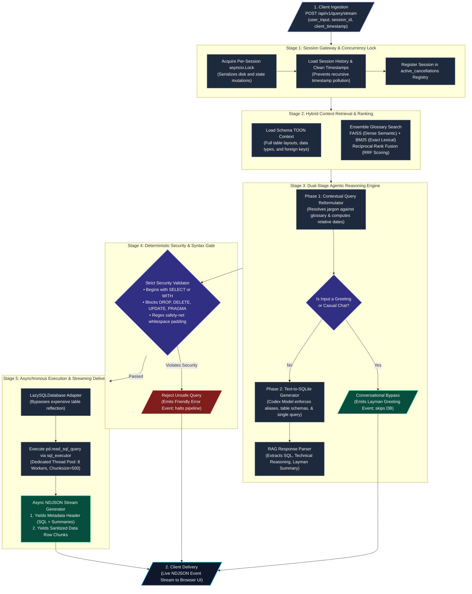

<p align="center">
  <h1>⚡ SQL Boomer</h1>
</p>

> **Autonomous, Fault-Tolerant Human-to-Database Translation Engine.**  
> Bridging the gap between non-technical business decision-makers and enterprise relational databases through hybrid semantic retrieval, deterministic safety guardrails, streaming analytics, and predictive intelligence.

<p align="center">
  <a href="https://www.python.org/"></a>
  <a href="https://fastapi.tiangolo.com/"></a>
  <a href="https://github.com/facebookresearch/faiss"></a>
  <a href="https://pypi.org/project/python-toon/"></a>
  <a href="https://www.sqlite.org/"></a>
  <a href="https://openrouter.ai/"></a>
  <a href="LICENSE"></a>
</p>

---

> *"The goal is to turn data into information, and information into insight."*  
> — **Carly Fiorina**

---

## Table of Contents

- [Overview](#overview)
- [The Core Philosophy](#the-core-philosophy)
- [System Architecture & Data Flow](#system-architecture--data-flow)
- [Core Technology Stack](#core-technology-stack)
- [Key Implemented Capabilities](#key-implemented-capabilities)
- [Outcomes: Speed, Resilience, and Ease](#outcomes-speed-resilience-and-ease)
- [Lessons Learned: Practical Realities of GenAI on Relational DBs](#lessons-learned-practical-realities-of-genai-on-relational-dbs)
- [Future Roadmap & Further Improvements](#future-roadmap--further-improvements)
- [API Reference & Endpoints](#api-reference--endpoints)
- [Getting Started & Local Development](#getting-started--local-development)
- [Proprietary License & Terms of Use](#proprietary-license--terms-of-use)

---

## Overview

In enterprise environments, there is a fundamental disconnect between the leaders making business decisions and the data they need to make them. 

A regional vice president or operations manager might need to know: *"Which home lots currently in framing status are experiencing construction holds due to supply chain delays, and what is their total base price across communities?"* 

While that information lives squarely inside relational database tables (`tblLots`, `tblHolds`, `tblCommunities`, `tblMilestones`), obtaining an answer typically requires filing a ticket with a data engineering team and waiting days for a custom report. Static dashboards—while helpful for high-level historical aggregates—are inherently rigid and incapable of handling ad-hoc, multi-layered exploratory questions.

### The Failure of Naive GenAI "Chat with Your Database" Wrappers

Recently, organizations have attempted to solve this bottleneck by connecting off-the-shelf generative AI models directly to their databases, hoping users could simply "chat" with their data. In practice, connecting raw LLMs directly to relational databases introduces severe operational, analytical, and security hazards:

1. **Schema & Column Hallucination**: Off-the-shelf models routinely invent phantom table names, assume column names that do not exist, or hallucinate foreign-key join paths that result in fatal SQL execution crashes.
2. **Jargon Misinterpretation**: Relational data relies on internal enterprise terminology. A raw model cannot know that *"Spec Home"* implies `tblLots.IsSpec = 1`, or that *"Big Ticket"* refers to lots where `BasePrice > 800000`.
3. **Database Server Starvation**: Naive models generate un-indexed full-table scans, un-SARGable WHERE filters, or accidental Cartesian products (`CROSS JOIN`) that can lock production database instances.
4. **Data Exfiltration Vulnerabilities**: Routing sensitive operational records through third-party cloud APIs poses unacceptable enterprise data exposure risks.

### The SQL Boomer Solution

**SQL Boomer was engineered to transcend simple chat wrappers.**

It operates as an autonomous, secure, and fault-tolerant **Human-to-Database Translation Engine**. Acting as a strict, reliable intermediary between non-technical business professionals and relational databases, SQL Boomer employs a multi-tiered architecture: query reformulation with client-relative temporal awareness, hybrid semantic/lexical glossary retrieval, deterministic SQL formatting and security gates, dedicated multi-pool asynchronous execution, mid-flight stream cancellation with turn rollback, and real-time predictive action follow-ups.

Crucially, **SQL Boomer is database- and industry-agnostic**. By separating computational business logic into interchangeable schema representations (TOON) and dynamic Business Glossary stores, the engine can be deployed across homebuilding, supply chain logistics, financial services, or healthcare without modifying the core application codebase.

---

## The Core Philosophy

SQL Boomer is engineered on four foundational architectural pillars:

```
┌─────────────────────────────────────────────────────────────────────────────┐
│                           SQL BOOMER CORE PILLARS                           │
├──────────────────────┬──────────────────────┬───────────────────────────────┤
│ Deterministic Safety │ Security & structure │ Strict SELECT-only gates,     │
│ Precedes AI Reasoning│ govern generation    │ PRAGMA blocking, and SQL      │
│                      │                      │ format sanitization run first.│
├──────────────────────┼──────────────────────┼───────────────────────────────┤
│ Hybrid Provenance    │ Dense semantic math  │ Combines FAISS embeddings     │
│ Retrieval            │ meets exact keyword  │ with BM25 keyword matching    │
│                      │ precision            │ for terms and schema context. │
├──────────────────────┼──────────────────────┼───────────────────────────────┤
│ Non-Blocking         │ Multi-executor pools │ Dedicated worker threads for  │
│ Concurrency          │ & session-level locks│ SQL (8), LLM (10), & Excel (3)│
│                      │ prevent starvation   │ with per-session asyncio.Lock.│
├──────────────────────┼──────────────────────┼───────────────────────────────┤
│ Ergonomic UX &       │ Streaming NDJSON with│ Progressive warnings (45-225s)│
│ Cancellation Control │ checkpoints & atomic │ with 4-stage mid-flight abort │
│                      │ transaction rollback │ & automatic history pruning.  │
└──────────────────────┴──────────────────────┴───────────────────────────────┘
```

1. **Deterministic Safety Over Generative Guesswork**: An enterprise data engine must never allow unstructured models to execute destructive commands or bypass structural constraints. Deterministic validators inspect queries before and after generation to guarantee strict read-only execution.
2. **Context-Preserved Retrieval**: Standard arbitrary text chunking shatters database tables across boundaries, severing columns from their parent tables. SQL Boomer utilizes Token-Oriented Object Notation (TOON) and hybrid retrieval to ensure the model evaluates tables as complete, unbroken structures.
3. **Thread-Safe Workload Isolation**: CPU-heavy Excel rendering, database I/O, and network-bound LLM completions are divided across isolated thread pools, ensuring multi-user concurrency without head-of-line blocking or file race conditions.
4. **Resilient User Ergonomics**: Users are never left wondering if an analytical scan is hung. Progressive reassurance warnings, real-time chunked streaming, and responsive mid-flight cancellation empower users with complete control.

---

## System Architecture & Data Flow

SQL Boomer decouples data ingestion, agentic reasoning, deterministic safety, and database streaming into a cleanly structured, unidirectional execution pipeline supported by dedicated concurrent watchdogs.

### 1. Primary Query Execution Pipeline



---

### 2. Guardrails, Cancellation & Predictive Sidecars

In parallel with the primary pipeline, three dedicated background services govern real-time responsiveness, safety, and follow-up recommendations:

```mermaid
flowchart LR
    %% Panel A: Cancellation
    subgraph G1 ["A. Cancellation & Watchdog Engine"]
        TIMER["Progressive Timer<br/>(Emits warnings at 45s, 90s, 135s, 180s, 225s)"]:::process
        CANCEL_GATE{"4 Checkpoints Checked:<br/>1. Pre-LLM<br/>2. In-Flight LLM<br/>3. Pre-DB<br/>4. Mid-Stream"}:::decision
        ABORT_ACTION["On Cancellation / Disconnect:<br/>1. Terminate Background LLM Task<br/>2. Rollback Uncommitted Turn from Disk<br/>3. Emit Cancellation Event"]:::error
        
        TIMER --> CANCEL_GATE --> ABORT_ACTION
    end

    %% Panel B: Predictive Intelligence
    subgraph G2 ["B. Predictive Next-Step Follow-ups"]
        PRED_REQ[/"POST /get_predictive_followups"/]:::input
        TRAJ["Extract User Query Trajectory<br/>(Last 5 user queries)"]:::process
        PRED_AGENT["Generate 4 User Action Chips<br/>(Imperative buttons, schema-grounded)"]:::process
        PRED_OUT[/"Return JSON Array of 4 Follow-ups"/]:::stream
        
        PRED_REQ --> TRAJ --> PRED_AGENT --> PRED_OUT
    end

    %% Panel C: Glossary Lifecycle
    subgraph G3 ["C. Dynamic Glossary Administration"]
        GLOSS_REQ[/"POST /manage_business_glossary"/]:::input
        GLOSS_PARSE["Dynamic Multi-Format Parser<br/>(Excel/CSV, ragged rows, WIP bounds)"]:::process
        GLOSS_ROTATE["Sliding-Window Snapshot Rotation<br/>(Active -> v1 -> v2)"]:::process
        GLOSS_RELOAD["Atomic Zero-Downtime Hot-Reload<br/>(Rebuilds FAISS/BM25 under glossary_lock)"]:::process
        
        GLOSS_REQ --> GLOSS_PARSE --> GLOSS_ROTATE --> GLOSS_RELOAD
    end

    %% Styling Classes
    classDef input fill:#1e293b,stroke:#818cf8,stroke-width:1.5px,color:#f8fafc;
    classDef process fill:#1e293b,stroke:#64748b,stroke-width:1px,color:#f8fafc;
    classDef decision fill:#312e81,stroke:#a5b4fc,stroke-width:1.5px,color:#f8fafc;
    classDef stream fill:#064e3b,stroke:#34d399,stroke-width:1.5px,color:#f8fafc;
    classDef error fill:#7f1d1d,stroke:#f87171,stroke-width:1.5px,color:#f8fafc;
```



---

## Core Technology Stack

| Layer | Technology | Primary Purpose |
| :--- | :--- | :--- |
| **Application Framework** | **FastAPI** (Python 3.12) | Asynchronous ASGI API gateway, CORS handling, and streaming NDJSON endpoints. |
| **AI Orchestration & LLMs** | **OpenRouter API** / **Native AsyncOpenAI** | LLM completion calls using high-reasoning models (`nemotron-3-super-120b`). |
| **Semantic Embeddings** | **HuggingFace** (`nomic-embed-text-v1.5`) | Local high-dimensional dense vector embeddings with full local execution. |
| **Vector Indexing** | **FAISS** (`faiss-cpu`) | Sub-millisecond similarity search over database schemas and business terms. |
| **Lexical Search** | **BM25Retriever** (Rank-BM25) | Exact keyword and alphanumeric identifier retrieval for specific entities and codes. |
| **Schema Representation** | **TOON** (Token-Oriented Object Notation) | High-density, token-efficient schema representation preserving complete table context. |
| **Database Engine** | **SQLite 3** & **SQLAlchemy** | Relational transactional database operations via connection pooling. |
| **Data Processing & Export** | **Pandas**, **openpyxl**, **XlsxWriter** | Chunked query iteration, vectorized XML sanitization, and styled Excel exports. |

---

## Key Implemented Capabilities

### 1. Robust Multi-Tier Agentic Query Pipeline
- **Phase 1: Intent & Jargon Reformulator**: Contextualizes user queries against recent session turns and injected business glossary terminology. Translates informal slang into strict mathematical filter logic while stripping conversational filler.
- **Conversational Bypass**: Detects generic greetings, thank-you messages, or casual remarks and routes them through a polite conversational handler, bypassing unnecessary SQL generation and preventing false database errors.
- **Phase 2: Text-to-SQLite Generator**: Converts standalone plain-English questions into valid, optimized SQLite queries. Strictly enforces table aliasing, time formatting (`date('now', 'localtime')`), and fuzzy string matching (`LIKE '%term%'`).
- **Resilient Fallback Handling**: External OpenRouter and LLM completions are fully protected with resilient exception boundaries. If network timeouts or authentication errors occur, the system gracefully falls back to structured explanatory guidance without crashing the event loop.

### 2. Transparent Async Hybrid Ensemble Retrieval
- **Dual Vector & Lexical Retrieval**: Pairs dense vector search (FAISS) with sparse term matching (BM25) to index the Business Glossary.
- **Reciprocal Rank Fusion (RRF)**: Merges results dynamically with rank-based scoring ($c=60$), ensuring rare acronyms, specific IDs, and conceptual synonyms receive balanced weighting.
- **Provenance Tracking**: Injects source retriever metadata and rank contributions into document objects for complete auditability.

### 3. Dedicated Concurrency Thread Pools & Lazy Database Adapter
- **Multi-Executor Isolation**: Background operations are partitioned into dedicated worker pools:
  - `sql_executor` (8 workers): Dedicated strictly to SQLite read queries.
  - `excel_executor` (3 workers): Dedicated to CPU-heavy Excel styling and data serialization.
  - `llm_executor` (10 workers): Dedicated to network-bound LLM completions.
- **`LazySQLDatabase` Adapter**: Subclasses LangChain's `SQLDatabase` to bypass eager table metadata reflection on startup, eliminating boot hangs and legacy schema crashes.

### 4. Thread-Safe Session Concurrency & Atomic Rollback
- **Per-Session Concurrency Locks**: Uses a dynamic registry of `asyncio.Lock` instances (`get_session_lock`) to serialize file access per session, eliminating race conditions when multiple queries or suggestions fire concurrently.
- **Turn-Based Chat Synchronization**: Pairs user questions and assistant answers under synchronized turn-based `chat_id`s, preserving exact timestamps while sanitizing recursive timestamp prefixes.
- **Atomic History Rollback**: If a query is cancelled mid-flight or the user disconnects, `remove_cancelled_interaction` prunes the unfinalized turn (highest `chat_id`) from disk to prevent conversational context corruption.

### 5. Progressive Streaming & Mid-Flight Cancellation
- **NDJSON Event Streaming**: Emits real-time newline-delimited JSON events:
  - `{"type": "metadata", "tech_summary": "...", "gen_summary": "...", "raw_sql": "..."}`
  - Followed by chunked row records: `{"CommunityName": "Whispering Pines", "Status": "Framing", ...}`
- **Progressive Reassurance Warnings**: Automatically yields status messages at scheduled thresholds (45s, 90s, 135s, 180s, 225s) during extensive scans to keep users informed.
- **Mid-Flight Cancellation Endpoints**: Exposes `/cancel_query/{session_id}` (and `/api/v1/query/cancel/{session_id}`) with 4 distinct checkpoints (pre-LLM, during LLM, pre-DB, and mid-stream) to halt query processing immediately upon user request.

### 6. Real-Time Predictive Next-Step Follow-ups
- **User-Perspective Action Buttons**: The `/get_predictive_followups` endpoint analyzes current questions, recent conversational trajectory, schema context, and business glossary definitions.
- **Proactive Guidance**: Returns 4 clickable follow-up chips phrased directly from the user's perspective (e.g., *"Group these results by community name."*, *"Show total base price across all builders."*), completely eliminating assistant-speak phrases like *"Would you like me to..."*.

### 7. Dynamic Business Glossary Administration & Version Rollback
- **Unified Management API**: The `/manage_business_glossary` endpoint supports both dynamic uploads (`action="upload"`) and instant rollbacks (`action="rollback"`).
- **Flexible Document Parsing**: Dynamically parses `.xlsx`, `.csv`, and `.json` files. Scans for table headers containing `Term` to skip instructional preambles, maps variable column aliases, handles ragged CSV lines, and supports `end_row` work-in-progress bounds.
- **Sliding-Window Version Control**: Maintains active, `v1`, and `v2` backups. Supports instant one-click rollback to prior versions.
- **Zero-Downtime Hot-Reload**: Invalidates in-memory indexes and pre-warms new FAISS and BM25 retrievers atomically using `glossary_lock`.

### 8. Smart Enterprise Excel Export
- **Vectorized XML Sanitization**: Strips illegal ASCII/XML control characters using vectorized Pandas replacements, running up to 100x faster than traditional row iterations.
- **Header Protection**: Cleanses and deduplicates table headers to prevent `xlsxwriter.add_table` crashes.
- **Context-Aware Chart Injection**: Inspects generated SQL for aggregation operators (`GROUP BY`, `SUM`, `COUNT`, `AVG`). Injects native Excel line or column charts for summarized data while keeping detailed line-item lists clean and readable.
- **High-Capacity Export**: Supports up to 150,000 rows with automatic CSV fallback for massive data volumes.

---

## Outcomes: Speed, Resilience, and Ease

By shifting the translation workload from human database engineers to an autonomous, fault-tolerant translation engine, SQL Boomer fundamentally transforms how teams interact with data:

- **Speed**: Answering complex, multi-table analytical questions drops from days of waiting for engineering tickets to seconds of automated processing.
- **Fault Tolerance**: Traditional relational databases fail if a user references an invalid column. SQL Boomer is designed to survive imperfect prompts: it reconciles user language with glossary logic, selects correct schema fields, and explains omissions politely in plain English.
- **Resilient Scaling**: Massive queries that would typically crash web applications are streamed asynchronously in chunks, keeping server RAM lean and responsive for all concurrent users.
- **Zero Data Lockout**: Business leaders are no longer forced to think like database administrators. They can ask natural questions in their own words and receive immediate, reliable, and secure answers.

---

## Lessons Learned: Practical Realities of GenAI on Relational DBs

Integrating generative language models with rigid, deterministic relational databases revealed critical engineering realities:

### 1. The "Midnight Trap" and Calendar Mathematics
Language models are notoriously unreliable at performing relative date calculations (such as computing the exact dates of "last month" or adjusting for leap years). When left to their own devices, models frequently default to naive string operations or inclusive `BETWEEN` operators that silently miss records logged precisely at midnight. 

**Solution**: Do not trust language models to calculate calendar boundaries. SQL Boomer injects the client's verified timestamp (`client_time`) into system prompts and instructs the model to use deterministic SQLite date functions (`date('now', 'localtime')`) rather than guessing static dates.

### 2. The Geometry of Data & Mixed Requests
Language models naturally try to fulfill every facet of a user prompt at once. If a user asks for *"a detailed list of all active lots and the grand total count"*, a model will attempt to force a single aggregate scalar into a tabular grid of detail rows, corrupting the relational shape of the output.

**Solution**: Train the engine with strict structural rules enforcing single queries and disallowing mixed requests. Guide users to request summaries and detailed breakdowns as distinct, sequential steps.

### 3. Preventing Context Shattering
Standard Retrieval-Augmented Generation (RAG) splits text into arbitrary character chunks (e.g., 500–1,000 tokens). Applying this technique to relational database schemas separates columns and constraints from their parent tables, severely impairing the model's ability to identify valid foreign-key relationships.

**Solution**: Utilize Token-Oriented Object Notation (TOON) and large cohesive schema blocks. Ensuring the model perceives a table's complete structure, data types, and primary/foreign keys as an unbroken unit eliminates join hallucinations.

> **Key Takeaway**: The success of an enterprise data system comes from knowing precisely when to let the AI be flexible with natural language, and when to enforce inflexible, hardcoded logic.

---

## Future Roadmap & Further Improvements

While SQL Boomer delivers robust core stability and enterprise UX, several advanced capabilities documented in our feature roadmap can further enhance the system:

```mermaid
graph LR
    subgraph Current ["Current Capabilities"]
        C1[Multi-Pool Concurrency]
        C2[Progressive Streaming]
        C3[Cancellation & Rollback]
        C4[Predictive Follow-ups]
        C5[Dynamic Glossary Admin]
    end

    subgraph Roadmap ["Future Roadmap Upgrades"]
        R1[LLM-as-a-Judge Bouncer]
        R2[Pre-Flight Cost Analyzer]
        R3[Silent Killer Detector]
        R4[Saved Golden Queries & CTEs]
        R5[Dynamic BI Insights Sidecar]
        R6[2-Way PII Masking Engine]
        R7[Automated Log Pruning]
        R8[Cross-Day Ambiguity Check]
    end

    Current -.-> Roadmap
```



### 1. LLM-as-a-Judge Bouncer & 3-Turn Self-Healing Feedback Loop
- **Objective**: Implement a dedicated automated evaluation layer (`evaluate_sql_with_judge`) powered by an independent model persona that audits drafted SQL against schema definitions and business rules before hitting the database.
- **Capability**: If the judge detects an invalid join or missing filter, it feeds specific feedback back to the generator for up to 3 self-correction attempts, attaching an audit badge to the output.

### 2. Pre-Flight Query Cost & Resource Analyzer (`EXPLAIN QUERY PLAN`)
- **Objective**: Run queries through database query plan analysis prior to live execution.
- **Capability**: Extract estimated query cost and scanned rows. If thresholds are exceeded, warn the user proactively and adjust chunk sizing before running expensive scans.

### 3. The 8-Point "Silent Killer" Heuristic Query Detector
- **Objective**: Implement a regex-based heuristics engine to catch query patterns known to bypass database indexes:
  - Leading wildcards (`LIKE '%term'`) forcing table scans.
  - Non-SARGable functions in WHERE and JOIN clauses (`strftime()`, `cast()`).
  - Unbounded heavy aggregations without date filters.
  - Accidental Cartesian products (`CROSS JOIN`) and large `OR` chains.

### 4. Saved / Golden Queries with Common Table Expression (CTE) Injection
- **Objective**: Allow users to build on verified enterprise baseline queries.
- **Capability**: Scan user prompts for tagged query names, retrieve pre-approved SQL from a golden repository, and inject it as a Common Table Expression (`WITH BaseSavedQuery AS (...)`).

### 5. 1-to-1 Table-Doc Schema Mapping
- **Objective**: Replace character-length chunk splitting with discrete table-level documents.
- **Capability**: Map each relational table into its own vector document containing descriptions, data types, and sample data rows, eliminating cross-chunk boundary fragmentation.

### 6. Dynamic BI Insights Sidecar with Two-Way PII Masking
- **Objective**: Deploy a sidecar worker (`/get_dynamic_insights`) to compute executive-level bullet points (volume, financial metrics, trends) on query results.
- **Privacy Engine**: Intercept data rows and replace all strings, customer names, and dates with generic tokens (`[ENTITY_1]`, `[DATE_1]`). Pass only anonymized metrics to the model, restoring actual names on the server before displaying results to ensure zero data leakage.

### 7. Automated Maintenance & Weekly History Pruning
- **Objective**: Implement an `APScheduler` cron task running weekly maintenance.
- **Capability**: Automatically prune long-inactive chat session logs exceeding retention limits to preserve disk capacity and prevent memory leaks.

### 8. Cross-Day Ambiguity Interceptor
- **Objective**: Detect when a user resumes a conversation on a subsequent calendar day.
- **Capability**: If a user enters an ambiguous follow-up (e.g., *"filter for top 5"*), clarify whether they are continuing yesterday's analysis or starting a new investigation.

---

## API Reference & Endpoints

### 1. Execute & Stream Query
- **Route**: `POST /api/v1/query/stream`
- **Description**: Asynchronously executes a question, streaming progressive warnings, metadata summaries, and data row chunks as NDJSON.
- **Payload**:
  ```json
  {
    "session_id": "04673832-6c16-4071-8e07-882a757fca4e",
    "user_input": "Show all lots currently in Framing status",
    "local_timestamp": "2026-09-12 19:30:00"
  }
  ```
- **Stream Output**:
  ```json
  {"type": "metadata", "session_id": "...", "tech_summary": "...", "gen_summary": "...", "raw_sql": "SELECT ..."}
  {"LotID": 101, "CommunityName": "Whispering Pines", "Status": "Framing", "BasePrice": 450000.0}
  {"LotID": 102, "CommunityName": "Desert Mirage", "Status": "Framing", "BasePrice": 520000.0}
  ```

### 2. Cancel Active Query
- **Route**: `POST /cancel_query/{session_id}` (Alias: `/api/v1/query/cancel/{session_id}`)
- **Description**: Signals immediate cancellation to an active stream and rolls back unfinalized turn history.
- **Response**:
  ```json
  {
    "status": "success",
    "message": "Cancellation requested for session 04673832-6c16-4071-8e07-882a757fca4e."
  }
  ```

### 3. Predictive Follow-ups
- **Route**: `POST /get_predictive_followups` (Alias: `/api/v1/query/predictive_followups`)
- **Description**: Generates 4 forward-looking, user-perspective action buttons based on trajectory.
- **Response**:
  ```json
  {
    "followups": [
      "Group these results by community name.",
      "Filter for records created in the last 30 days.",
      "Show total base price across all builders.",
      "Sort these lots by highest base price."
    ]
  }
  ```

### 4. Manage Business Glossary
- **Route**: `POST /manage_business_glossary` (Alias: `/api/v1/glossary/manage`)
- **Description**: Uploads a new glossary (.xlsx, .csv, .json) or rolls back to a prior snapshot (`v1`, `v2`).
- **Upload Request**: Multipart form data with `action="upload"` and `file=@glossary.csv`.
- **Rollback Request**: Form data with `action="rollback"` and `version="v1"`.
- **Response**:
  ```json
  {
    "status": "success",
    "message": "Business glossary updated and vector cache reloaded successfully.",
    "total_terms": 14
  }
  ```

### 5. Smart Excel Export
- **Route**: `POST /api/v1/query/export`
- **Description**: Exports the active query result into a professionally styled, sanitised Excel spreadsheet with charts.
- **Response**: Binary `.xlsx` stream (`application/vnd.openxmlformats-officedocument.spreadsheetml.sheet`).

### 6. Historical Suggestions
- **Route**: `GET /api/v1/session/{session_id}/suggestions`
- **Description**: Generates workflow suggestions based on past queries in the session.

---

## Getting Started & Local Development

### Prerequisites
- Python 3.12+
- SQLite 3
- Git

### 1. Clone & Set Up Virtual Environment
```bash
git clone https://github.com/BhavyaBhargava/SQL_Boomer.git
cd SQL_Boomer

# Create and activate virtual environment
python3 -m venv sql_venv
source sql_venv/bin/activate

# Install required dependencies
pip install fastapi uvicorn pydantic pandas sqlalchemy \
            langchain-core langchain-community langchain-huggingface \
            sentence-transformers faiss-cpu rank-bm25 python-toon \
            openai python-multipart openpyxl xlsxwriter pytz python-dotenv
```

### 2. Configure Environment Variables
Create a `.env` file in the project root:
```env
OPENROUTER_API_KEY=your_openrouter_api_key_here
SQLITE_DB_PATH=sqlite:///enterprise_mock.db
```

### 3. Seed Database & Initialize Mock Data
Generate the mock enterprise database with realistic communities, builders, lots, and milestones:
```bash
python seed_db.py
```

### 4. Launch the API Gateway
Start the FastAPI server:
```bash
uvicorn api_gateway:app --reload --host 0.0.0.0 --port 8000
```
Interactive API documentation will be available at `http://localhost:8000/docs`.

### 5. Run the End-to-End Component Audit Suite
Verify all 8 subsystems (Database, Retrievers, Concurrency, Streaming, Cancellation, Predictive Follow-ups, Glossary Lifecycle, and Export):
```bash
python scratch_audit_test.py
```

---

## Proprietary License & Terms of Use

**Copyright © 2026 Bhavya Bhargava. All rights reserved.**

### Strict Proprietary & Permission Notice

This software, source code, data architectures, system design patterns, workflows, prompts, algorithms, and associated documentation are **strictly proprietary and confidential**. 

> [!CAUTION]
> **Explicit Written Permission Required**:
> Whosoever wishes to use, deploy, reproduce, reference, modify, or integrate this project—**or even a single component, utility, module, or architecture pattern thereof**—**MUST obtain prior, explicit written permission directly from Bhavya Bhargava**.

- **No Open-Source Rights**: This repository is NOT open-source and is NOT licensed under MIT, Apache, GPL, or any permissive open-source license. No license or grant of rights is given by default to any individual, enterprise, government agency, or educational institution.
- **Strict Prohibition on Component-Level Borrowing**: Disassembling, borrowing, adapting, or deploying ANY component (including but not limited to the Lazy Database adapter, cancellation engine, session locks, dynamic glossary parser, predictive follow-up service, or TOON schema integration) without prior express authorization is strictly prohibited.
- **Enforcement & Legal Action**: In-eligibility or failure to obtain explicit written authorization prior to using any portion of this repository constitutes willful intellectual property infringement. Any unauthorized use, distribution, or reproduction will result in immediate legal action, statutory infringement claims, and all remedies available under civil and criminal law.

For official permission inquiries or enterprise licensing evaluation, contact **Bhavya Bhargava**.

### Acknowledgments

- **LangChain** — for vector retrieval and message abstraction foundations.
- **FAISS (Facebook AI Research)** — for ultra-fast dense similarity search.
- **OpenRouter** — for unified API access to cutting-edge reasoning models.
- **TOON** — for high-efficiency token-oriented object notation.
- **FastAPI** — for modern, high-performance asynchronous web architecture.

---

<p align="center">
  Built with care for data teams and business leaders who believe enterprise database interaction should be conversational, instantaneous, and secure.
</p>
